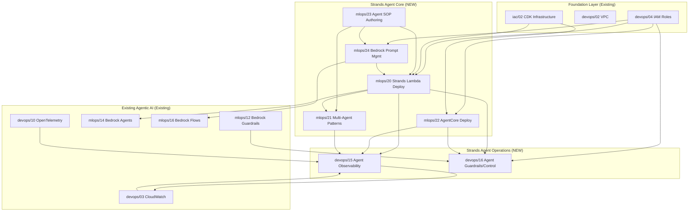

# Design Document: Strands Agents Templates

## Overview

This design adds 7 new templates to the F369 AWS MLOps & AI/LLM CI/CD Prompt Template Library, expanding it from 67 to 74 templates. The new templates cover the Strands Agents open-source SDK ecosystem and related AWS services for building, deploying, observing, and governing AI agents.

The 7 new templates are:

| # | Path | Title |
|---|------|-------|
| 20 | `mlops/20_strands_agent_lambda_deployment.md` | Strands Agent Lambda Deployment |
| 21 | `mlops/21_strands_multi_agent_patterns.md` | Strands Multi-Agent Patterns |
| 22 | `mlops/22_strands_agentcore_deployment.md` | Strands AgentCore Deployment |
| 23 | `mlops/23_agent_sop_authoring.md` | Agent SOP Authoring |
| 24 | `mlops/24_bedrock_prompt_management.md` | Bedrock Prompt Management |
| 15 | `devops/15_strands_agent_observability.md` | Strands Agent Observability |
| 16 | `devops/16_agent_guardrails_control.md` | Agent Guardrails and Control |

Each template is a self-contained markdown prompt file following the established F369 format. Users paste a template into an LLM (Claude or equivalent) to generate production-ready AWS infrastructure code. Templates are NOT executable code — they are prompt engineering artifacts containing role definitions, parameterized inputs, file-by-file generation instructions, code scaffolding hints with concrete Strands SDK and AWS API calls, and integration points for chaining.

### Design Goals

- Maintain strict consistency with the established F369 template format across all 7 new templates
- Ensure accurate Strands SDK API references (`strands-agents` 1.x+, `strands-agents-tools` 1.x+) and AWS API references (boto3 1.35+, CDK 2.170+)
- Build a coherent integration graph where the 7 new templates chain together and connect to existing templates
- Provide clear decision guidance for when to use Lambda deployment (mlops/20) vs AgentCore deployment (mlops/22)
- Cover the full agent lifecycle: author SOPs → manage prompts → deploy agents → orchestrate multi-agent → observe → govern

### Key Decisions

1. **Strands SDK as primary agent framework**: All agent templates use the `strands-agents` Python SDK with `Agent()`, `BedrockModel()`, `MCPClient()`, and community tools. This complements the existing Bedrock Agents templates (mlops/12, mlops/14) which use the managed Bedrock Agent service.
2. **Two deployment targets**: Lambda (mlops/20) for stateless, event-driven agents with short execution times; AgentCore (mlops/22) for stateful, long-running agents with session isolation. Each template includes a comparison section.
3. **Agent SOPs as structured markdown**: SOPs (mlops/23) use RFC 2119 keywords and `{{parameter}}` syntax, loadable as Strands Agent system prompts or standalone workflow documents.
4. **Bedrock Prompt Management as a standalone template**: Separated from mlops/12 to provide deeper coverage of the Prompt Management API lifecycle (create → version → deploy → A/B test → integrate with Flows).
5. **Agent Control for runtime guardrails**: devops/16 covers Strands Agent Control (runtime policy without code changes) plus Bedrock Guardrails integration, extending mlops/12's guardrails patterns to the Strands ecosystem.

---

## Architecture

### Expanded Directory Structure (New Templates Only)

```
F369_LLM_TEMPLATES/
├── mlops/                                 (25 templates: 00-24)
│   ├── 00-19                              Existing templates (unchanged)
│   ├── 20_strands_agent_lambda_deployment.md     NEW — Strands Agent on Lambda + CDK
│   ├── 21_strands_multi_agent_patterns.md        NEW — Graph/Swarm/Workflow patterns
│   ├── 22_strands_agentcore_deployment.md        NEW — AgentCore Runtime deployment
│   ├── 23_agent_sop_authoring.md                 NEW — Agent SOP markdown authoring
│   └── 24_bedrock_prompt_management.md           NEW — Prompt Management API lifecycle
│
├── devops/                                (16 templates: 01-16)
│   ├── 01-14                              Existing templates (unchanged)
│   ├── 15_strands_agent_observability.md         NEW — Agent OTel tracing + metrics
│   └── 16_agent_guardrails_control.md            NEW — Agent Control + Bedrock Guardrails
│
└── [all other directories unchanged]
```


### Template Integration Graph

The following diagram shows how the 7 new Strands templates integrate with each other and with existing templates:



### Strands Agent Deployment Chain (Recommended Build Order)

```
devops/04 (IAM)
    → mlops/23 (Agent SOP Authoring)
    → mlops/24 (Bedrock Prompt Management)
    → mlops/20 (Strands Lambda Deployment)  OR  mlops/22 (AgentCore Deployment)
    → mlops/21 (Multi-Agent Patterns)
    → devops/15 (Agent Observability)
    → devops/16 (Agent Guardrails & Control)
```

### Lambda vs AgentCore Decision Matrix

| Factor | Lambda (mlops/20) | AgentCore (mlops/22) |
|--------|-------------------|----------------------|
| Session duration | < 15 min | Minutes to hours |
| State management | DynamoDB + conversation manager | MicroVM session isolation |
| Cold start | ~2-5s with layer | Warm pool available |
| Scaling | Automatic (Lambda concurrency) | Configurable min/max instances |
| Identity integration | IAM + API Gateway authorizer | Cognito, Entra ID, Okta native |
| Cost model | Per-invocation + duration | Per-session + compute time |
| Best for | Event-driven, short tasks, APIs | Long conversations, complex workflows |

---

## Components and Interfaces

### Template Anatomy (Shared Structure)

Every new template follows the established F369 format:

```markdown
<!-- Template Version: 1.0 | boto3: 1.35+ | strands-agents: 1.x+ | [additional versions] -->

# Template [Category] [Number] — [Title]

## Purpose
[One paragraph describing what the LLM will generate]

## Role Definition
[Expert persona with Strands SDK + AWS service expertise]

## Context & Inputs
[Parameterized block with REQUIRED and OPTIONAL fields]

## Task
[ASCII directory tree + file-by-file generation instructions with API calls]

## Output Format
[Standard: "Output ALL files with headers: `### FILE: [path]`"]

## Requirements & Constraints
[Security, cost, naming, Strands SDK constraints]

## Code Scaffolding Hints
[Working Strands SDK + AWS SDK code snippets]

## Integration Points
[Upstream/Downstream references using category/number format]
```

### Shared Parameter Convention

All 7 new templates begin their Context & Inputs section with:

```
PROJECT_NAME:           [REQUIRED]
AWS_REGION:             [REQUIRED]
AWS_ACCOUNT_ID:         [REQUIRED]
ENV:                    [REQUIRED - dev | stage | prod]
```

### Resource Naming Convention

All generated AWS resources follow: `{PROJECT_NAME}-{component}-{ENV}`

Examples:
- `myai-strands-agent-lambda-prod`
- `myai-agentcore-endpoint-dev`
- `myai-agent-sessions-stage`

### Template Component Details

#### 1. Strands Agent Lambda Deployment (mlops/20)

| Aspect | Detail |
|--------|--------|
| Primary Services | Lambda, API Gateway, DynamoDB, Bedrock Runtime |
| Strands SDK | `Agent()`, `BedrockModel()`, `MCPClient()`, `SlidingWindowConversationManager`, `SummarizingConversationManager` |
| CDK Constructs | `PythonFunction`, `RestApi` / `HttpApi`, `Table` |
| Lambda Layer | Official `strands-agents` Lambda layer ARN |

Key API calls and patterns:
```python
# Strands Agent initialization
from strands import Agent
from strands.models.bedrock import BedrockModel
from strands.tools.mcp import MCPClient

model = BedrockModel(
    model_id="us.anthropic.claude-sonnet-4-20250514-v1:0",
    region_name="us-east-1",
    max_tokens=4096,
    temperature=0.7,
)

agent = Agent(
    model=model,
    system_prompt="You are a helpful assistant...",
    tools=[tool_1, tool_2],
    conversation_manager=SlidingWindowConversationManager(window_size=40),
)

# MCP client for tool servers
mcp_client = MCPClient(lambda: StdioServerParameters(
    command="uvx",
    args=["awslabs.aws-documentation-mcp-server@latest"],
))

with mcp_client:
    agent = Agent(model=model, tools=[mcp_client])
    response = agent("What is Amazon Bedrock?")

# Lambda handler pattern
def lambda_handler(event, context):
    body = json.loads(event.get("body", "{}"))
    prompt = body.get("prompt", "")
    session_id = body.get("session_id", str(uuid.uuid4()))
    
    # Load session state from DynamoDB
    session = load_session(session_id)
    
    agent = Agent(
        model=model,
        system_prompt=SYSTEM_PROMPT,
        tools=tools,
    )
    
    response = agent(prompt)
    
    # Save session state
    save_session(session_id, agent.conversation_manager)
    
    return {
        "statusCode": 200,
        "body": json.dumps({
            "response": str(response),
            "session_id": session_id,
        }),
    }
```

Project structure generated:
```
{PROJECT_NAME}-strands-lambda/
├── cdk/
│   ├── app.py
│   └── strands_agent_stack.py         # CDK stack: Lambda + API GW + DynamoDB
├── lambda_handler/
│   ├── handler.py                     # Lambda entry point with Agent init
│   ├── agent_config.py                # Agent configuration (model, tools, prompts)
│   ├── mcp_setup.py                   # MCPClient configuration for tool servers
│   └── session_manager.py            # DynamoDB session persistence
├── tools/
│   └── custom_tools.py               # Custom @tool decorated functions
├── tests/
│   └── test_handler.py
└── requirements.txt
```

#### 2. Strands Multi-Agent Patterns (mlops/21)

| Aspect | Detail |
|--------|--------|
| Primary Services | Bedrock Runtime, Lambda (optional), Step Functions (optional) |
| Strands SDK | `Agent()`, community tools: `graph`, `swarm`, `workflow`, `use_agent`, `a2a_client`, `think`, `handoff_to_user` |
| Patterns | Graph (DAG), Swarm (dynamic handoff), Workflow (sequential pipeline) |

Key API calls and patterns:
```python
# Graph pattern — DAG execution with conditional branching
from strands import Agent
from strands_tools import graph

coordinator = Agent(
    model=model,
    system_prompt="You coordinate tasks across specialized agents...",
    tools=[graph],
)

# Define graph nodes as agents
researcher = Agent(model=model, system_prompt="You research topics...")
writer = Agent(model=model, system_prompt="You write content...")
reviewer = Agent(model=model, system_prompt="You review content...")

# Swarm pattern — dynamic handoff between agents
from strands_tools import swarm

swarm_agent = Agent(
    model=model,
    system_prompt="Route to the right specialist...",
    tools=[swarm],
)

# Workflow pattern — sequential pipeline
from strands_tools import workflow

pipeline_agent = Agent(
    model=model,
    system_prompt="Execute steps in order...",
    tools=[workflow],
)

# Agents-as-tools pattern
from strands_tools import use_agent

orchestrator = Agent(
    model=model,
    system_prompt="You orchestrate sub-agents...",
    tools=[use_agent],
)

# Shared state via invocation_state
agent = Agent(model=model, tools=tools)
agent.invocation_state["shared_context"] = {"key": "value"}
response = agent("Process this with shared context")
# Sub-agents access via their own invocation_state

# A2A protocol for cross-framework communication
from strands_tools import a2a_client

agent_with_a2a = Agent(
    model=model,
    tools=[a2a_client],
    system_prompt="You can communicate with external agents via A2A...",
)

# Think tool for explicit reasoning
from strands_tools import think

reasoning_agent = Agent(
    model=model,
    tools=[think, *other_tools],
    system_prompt="Think step by step before acting...",
)
```

Project structure generated:
```
{PROJECT_NAME}-multi-agent/
├── agents/
│   ├── agent_definitions.py           # All agent definitions with roles
│   ├── shared_state.py                # invocation_state management
│   └── tools_registry.py             # Tool registration per agent
├── patterns/
│   ├── graph_pattern.py               # DAG execution with graph tool
│   ├── swarm_pattern.py               # Dynamic handoff with swarm tool
│   └── workflow_pattern.py            # Sequential pipeline with workflow tool
├── a2a/
│   ├── a2a_server.py                  # A2A protocol server endpoint
│   └── a2a_client_config.py           # A2A client configuration
├── orchestrator/
│   ├── main.py                        # Entry point for multi-agent execution
│   └── error_handling.py             # Fallback routing and error propagation
├── tests/
│   └── test_patterns.py
└── requirements.txt
```

#### 3. Strands AgentCore Deployment (mlops/22)

| Aspect | Detail |
|--------|--------|
| Primary Services | Amazon Bedrock AgentCore Runtime, Cognito/Entra ID/Okta |
| Strands SDK | `Agent()`, `BedrockModel()`, session persistence via AgentCore microVM |
| Key APIs | AgentCore Runtime deployment APIs, session management, health checks |

Key API calls and patterns:
```python
# AgentCore Runtime deployment configuration
# AgentCore provides serverless runtime with microVM isolation
import boto3

agentcore_client = boto3.client("bedrock-agentcore", region_name=AWS_REGION)

# Create runtime endpoint for Strands agent
response = agentcore_client.create_runtime_endpoint(
    name=f"{PROJECT_NAME}-agentcore-{ENV}",
    agentRuntimeArtifact={
        "s3": {
            "s3BucketName": f"{PROJECT_NAME}-artifacts-{ENV}",
            "s3ObjectKey": "agent-package.zip",
        }
    },
    roleArn=agentcore_role_arn,
    networkConfiguration={
        "networkMode": "PUBLIC",  # or "VPC" for private
    },
    environmentVariables={
        "MODEL_ID": "us.anthropic.claude-sonnet-4-20250514-v1:0",
        "AGENT_SYSTEM_PROMPT": "...",
    },
)

endpoint_id = response["endpointId"]

# Identity provider integration
identity_config = {
    "cognitoConfig": {
        "userPoolId": cognito_user_pool_id,
        "clientId": cognito_client_id,
    }
}

# Auto-scaling configuration
scaling_config = {
    "minInstances": 1 if ENV == "prod" else 0,
    "maxInstances": 10 if ENV == "prod" else 2,
}

# Invoke deployed agent
agentcore_runtime = boto3.client("bedrock-agentcore-runtime", region_name=AWS_REGION)

response = agentcore_runtime.invoke_agent(
    endpointId=endpoint_id,
    sessionId=session_id,
    inputText="Hello, help me with...",
)

# Health check
health = agentcore_client.get_runtime_endpoint(endpointId=endpoint_id)
status = health["status"]  # ACTIVE, CREATING, FAILED
```

Project structure generated:
```
{PROJECT_NAME}-agentcore/
├── agent/
│   ├── agent_app.py                   # Strands Agent application entry point
│   ├── agent_config.py                # Agent configuration
│   └── requirements.txt              # Agent dependencies (strands-agents, etc.)
├── deployment/
│   ├── deploy_agentcore.py            # AgentCore Runtime deployment script
│   ├── identity_setup.py             # Identity provider integration
│   ├── scaling_config.py             # Auto-scaling configuration
│   └── health_check.py              # Health check and rollback patterns
├── invoke/
│   ├── invoke_agent.py               # Python SDK invocation example
│   └── invoke_agent.ts              # TypeScript SDK invocation example
├── cdk/
│   └── agentcore_stack.py            # CDK stack for supporting resources
├── tests/
│   └── test_deployment.py
└── requirements.txt
```

#### 4. Agent SOP Authoring (mlops/23)

| Aspect | Detail |
|--------|--------|
| Primary Services | None (pure markdown authoring) |
| Strands SDK | SOPs loaded as `system_prompt` in `Agent()` |
| Format | Structured markdown with RFC 2119 keywords |

Key patterns:
```markdown
# SOP: Data Retrieval and Report Generation

## Purpose
Retrieve data from specified sources and generate a formatted report.

## Scope
This SOP applies to all data retrieval tasks involving internal databases
and external APIs.

## Inputs
- {{data_source}}: string — The data source identifier (REQUIRED)
- {{report_format}}: string — Output format: markdown | html | pdf (DEFAULT: markdown)
- {{date_range}}: string — Date range for data retrieval (OPTIONAL)

## Outputs
- Generated report in the specified format
- Data retrieval summary with record counts

## Procedure

### Step 1: Validate Inputs
The agent MUST validate that {{data_source}} is a recognized source.
The agent SHOULD check connectivity to the data source before proceeding.
The agent MUST NOT proceed if the data source is unreachable after 3 retries.

### Step 2: Retrieve Data
The agent MUST query the data source using the provided {{date_range}}.
The agent SHOULD apply pagination for result sets exceeding 1000 records.
The agent MAY cache intermediate results for large datasets.

[PROGRESS: Step 2 complete — {{record_count}} records retrieved]

### Step 3: Generate Report
The agent MUST format the output according to {{report_format}}.
The agent SHOULD include a summary section with key metrics.

[PROGRESS: Step 3 complete — Report generated]

## Error Handling
IF data source returns an error THEN the agent MUST log the error and
notify the user with the error details.
IF partial data is retrieved THEN the agent SHOULD generate a partial
report and indicate incomplete data.

## Resume Point
This SOP supports resumption from any step. On resume, the agent MUST
verify the state of previously completed steps before continuing.
```

```python
# Loading SOP as Strands Agent system prompt
from strands import Agent
from strands.models.bedrock import BedrockModel

with open("sops/data_retrieval.md") as f:
    sop_content = f.read()

# Parameterize the SOP
sop_prompt = sop_content.replace("{{data_source}}", "sales_db")
sop_prompt = sop_prompt.replace("{{report_format}}", "markdown")

agent = Agent(
    model=BedrockModel(model_id="us.anthropic.claude-sonnet-4-20250514-v1:0"),
    system_prompt=sop_prompt,
    tools=[db_query_tool, report_generator_tool],
)

response = agent("Execute the data retrieval SOP for Q4 2024")
```

Project structure generated:
```
{PROJECT_NAME}-agent-sops/
├── sops/
│   ├── templates/
│   │   ├── data_retrieval.md          # Data retrieval SOP template
│   │   ├── report_generation.md       # Report generation SOP template
│   │   └── approval_workflow.md       # Multi-step approval SOP template
│   ├── sop_schema.md                 # SOP format specification
│   └── sop_chaining.md              # SOP-to-SOP reference patterns
├── loader/
│   ├── sop_loader.py                 # Load and parameterize SOPs
│   ├── sop_validator.py              # Validate SOP structure
│   └── progress_tracker.py           # Track step completion
├── examples/
│   ├── run_sop_agent.py              # Example: run agent with SOP
│   └── chain_sops.py                # Example: chain multiple SOPs
└── requirements.txt
```

#### 5. Bedrock Prompt Management (mlops/24)

| Aspect | Detail |
|--------|--------|
| Primary Services | Bedrock Agent (Prompt Management APIs) |
| Key APIs | `bedrock_agent.create_prompt()`, `create_prompt_version()`, `get_prompt()` |
| Integration | Bedrock Flows prompt nodes, Strands Agent system prompts |

Key API calls and patterns:
```python
import boto3

bedrock_agent = boto3.client("bedrock-agent", region_name=AWS_REGION)

# Create a prompt template
response = bedrock_agent.create_prompt(
    name=f"{PROJECT_NAME}-qa-prompt-{ENV}",
    description="Question answering prompt with context",
    defaultVariant="v1",
    variants=[
        {
            "name": "v1",
            "modelId": "anthropic.claude-3-5-sonnet-20241022-v2:0",
            "templateType": "TEXT",
            "templateConfiguration": {
                "text": {
                    "text": "Answer based on context:\n{{context}}\n\nQuestion: {{question}}",
                    "inputVariables": [
                        {"name": "context"},
                        {"name": "question"},
                    ],
                }
            },
            "inferenceConfiguration": {
                "text": {
                    "temperature": 0.7,
                    "maxTokens": 2048,
                }
            },
        }
    ],
    tags={"Project": PROJECT_NAME, "Environment": ENV},
)

prompt_id = response["id"]

# Create immutable version
version_response = bedrock_agent.create_prompt_version(
    promptIdentifier=prompt_id,
    description="Production-ready v1",
)
prompt_version = version_response["version"]

# Retrieve prompt for use
prompt = bedrock_agent.get_prompt(
    promptIdentifier=prompt_id,
    promptVersion=prompt_version,
)

# Use in Strands Agent
template_text = prompt["variants"][0]["templateConfiguration"]["text"]["text"]
agent = Agent(
    model=model,
    system_prompt=template_text.replace("{{context}}", context),
)

# A/B testing with variants
response_v1 = bedrock_agent.create_prompt(
    name=f"{PROJECT_NAME}-ab-prompt-{ENV}",
    defaultVariant="variant_a",
    variants=[
        {
            "name": "variant_a",
            "modelId": "anthropic.claude-3-5-sonnet-20241022-v2:0",
            "templateType": "TEXT",
            "templateConfiguration": {
                "text": {
                    "text": "Concise answer: {{question}}",
                    "inputVariables": [{"name": "question"}],
                }
            },
        },
        {
            "name": "variant_b",
            "modelId": "anthropic.claude-3-5-sonnet-20241022-v2:0",
            "templateType": "TEXT",
            "templateConfiguration": {
                "text": {
                    "text": "Detailed answer with examples: {{question}}",
                    "inputVariables": [{"name": "question"}],
                }
            },
        },
    ],
)

# Reference managed prompt in Bedrock Flow prompt node
prompt_flow_node = {
    "type": "Prompt",
    "name": "ManagedPromptNode",
    "configuration": {
        "prompt": {
            "sourceConfiguration": {
                "resource": {
                    "promptArn": f"arn:aws:bedrock:{AWS_REGION}:{AWS_ACCOUNT_ID}:prompt/{prompt_id}:{prompt_version}",
                }
            }
        }
    },
}
```

Project structure generated:
```
{PROJECT_NAME}-prompt-management/
├── prompts/
│   ├── create_prompt.py               # Create prompt templates with variants
│   ├── version_manager.py            # Version lifecycle: draft → review → deploy
│   ├── prompt_retriever.py           # Retrieve and cache prompt versions
│   └── ab_testing.py                 # A/B test prompt variants with metrics
├── integration/
│   ├── strands_integration.py        # Load managed prompts into Strands agents
│   ├── flows_integration.py          # Reference prompts in Bedrock Flow nodes
│   └── fallback_cache.py            # Local cache fallback for prompt retrieval
├── lifecycle/
│   ├── promote_prompt.py             # Promote prompt across environments
│   └── rollback_prompt.py           # Rollback to previous version
├── config.py
├── run_setup.py
└── requirements.txt
```


#### 6. Strands Agent Observability (devops/15)

| Aspect | Detail |
|--------|--------|
| Primary Services | X-Ray, CloudWatch, ADOT, Lambda |
| Strands SDK | Built-in tracing hooks, custom span creation around agent loop |
| Extends | devops/10 (OpenTelemetry ML Tracing) with agent-specific instrumentation |

Key API calls and patterns:
```python
# OpenTelemetry instrumentation for Strands agent loop
from opentelemetry import trace
from opentelemetry.trace import StatusCode
from strands import Agent
from strands.models.bedrock import BedrockModel
import time

tracer = trace.get_tracer("strands-agent", "1.0.0")

def traced_agent_invocation(agent: Agent, prompt: str, session_id: str):
    """Invoke a Strands agent with full OpenTelemetry tracing."""
    with tracer.start_as_current_span("strands.agent.invoke") as span:
        span.set_attribute("agent.session_id", session_id)
        span.set_attribute("agent.prompt_length", len(prompt))
        
        start = time.perf_counter()
        try:
            response = agent(prompt)
            latency_ms = (time.perf_counter() - start) * 1000
            
            span.set_attribute("agent.latency_ms", latency_ms)
            span.set_attribute("agent.response_length", len(str(response)))
            
            # Extract metrics from agent state
            if hasattr(agent, 'trace'):
                span.set_attribute("agent.loop_iterations", 
                    agent.trace.get("loop_count", 0))
                span.set_attribute("agent.tool_calls_count",
                    agent.trace.get("tool_calls", 0))
            
            return response
            
        except Exception as e:
            latency_ms = (time.perf_counter() - start) * 1000
            span.set_attribute("agent.latency_ms", latency_ms)
            span.set_status(StatusCode.ERROR, str(e))
            span.record_exception(e)
            raise

# Custom spans for individual tool calls
def traced_tool_call(tool_name: str, tool_input: dict):
    """Wrap a tool call with OpenTelemetry span."""
    with tracer.start_as_current_span(f"strands.tool.{tool_name}") as span:
        span.set_attribute("tool.name", tool_name)
        span.set_attribute("tool.input_size", len(str(tool_input)))
        
        start = time.perf_counter()
        try:
            result = execute_tool(tool_name, tool_input)
            latency_ms = (time.perf_counter() - start) * 1000
            
            span.set_attribute("tool.latency_ms", latency_ms)
            span.set_attribute("tool.success", True)
            span.set_attribute("tool.output_size", len(str(result)))
            return result
            
        except Exception as e:
            span.set_attribute("tool.success", False)
            span.set_status(StatusCode.ERROR, str(e))
            span.record_exception(e)
            raise

# CloudWatch custom metrics for agent KPIs
import boto3

cloudwatch = boto3.client("cloudwatch", region_name=AWS_REGION)

def publish_agent_metrics(agent_name, metrics):
    """Publish agent-level metrics to CloudWatch."""
    cloudwatch.put_metric_data(
        Namespace=f"{PROJECT_NAME}/StrandsAgents",
        MetricData=[
            {
                "MetricName": "InvocationsPerMinute",
                "Value": metrics["invocations"],
                "Unit": "Count",
                "Dimensions": [
                    {"Name": "AgentName", "Value": agent_name},
                    {"Name": "Environment", "Value": ENV},
                ],
            },
            {
                "MetricName": "AvgToolCallsPerInvocation",
                "Value": metrics["avg_tool_calls"],
                "Unit": "Count",
                "Dimensions": [
                    {"Name": "AgentName", "Value": agent_name},
                    {"Name": "Environment", "Value": ENV},
                ],
            },
            {
                "MetricName": "ErrorRate",
                "Value": metrics["error_rate"],
                "Unit": "Percent",
                "Dimensions": [
                    {"Name": "AgentName", "Value": agent_name},
                    {"Name": "Environment", "Value": ENV},
                ],
            },
            {
                "MetricName": "P99Latency",
                "Value": metrics["p99_latency_ms"],
                "Unit": "Milliseconds",
                "Dimensions": [
                    {"Name": "AgentName", "Value": agent_name},
                    {"Name": "Environment", "Value": ENV},
                ],
            },
        ],
    )

# CloudWatch dashboard definition
dashboard_body = {
    "widgets": [
        {
            "type": "metric",
            "properties": {
                "title": "Agent Invocations",
                "metrics": [
                    [f"{PROJECT_NAME}/StrandsAgents", "InvocationsPerMinute",
                     "AgentName", agent_name, "Environment", ENV],
                ],
                "period": 60,
                "stat": "Sum",
            },
        },
        {
            "type": "metric",
            "properties": {
                "title": "Agent Latency (p50/p90/p99)",
                "metrics": [
                    [f"{PROJECT_NAME}/StrandsAgents", "P99Latency",
                     "AgentName", agent_name, "Environment", ENV,
                     {"stat": "p99"}],
                    [f"{PROJECT_NAME}/StrandsAgents", "P99Latency",
                     "AgentName", agent_name, "Environment", ENV,
                     {"stat": "p90"}],
                    [f"{PROJECT_NAME}/StrandsAgents", "P99Latency",
                     "AgentName", agent_name, "Environment", ENV,
                     {"stat": "p50"}],
                ],
                "period": 300,
            },
        },
        {
            "type": "metric",
            "properties": {
                "title": "Tool Usage Distribution",
                "metrics": [
                    [f"{PROJECT_NAME}/StrandsAgents", "ToolCallCount",
                     "ToolName", tool_name, "Environment", ENV]
                    for tool_name in ["retrieve", "shell", "editor", "use_aws"]
                ],
                "period": 300,
                "stat": "Sum",
                "view": "bar",
            },
        },
    ],
}
```

Project structure generated:
```
{PROJECT_NAME}-agent-observability/
├── instrumentation/
│   ├── tracer_setup.py                # OTel tracer provider for Strands agents
│   ├── agent_tracing.py              # Agent loop and tool call span wrappers
│   ├── token_tracking.py             # Token usage tracking per invocation
│   └── span_attributes.py            # Agent-specific span attribute constants
├── metrics/
│   ├── agent_metrics.py              # CloudWatch custom metrics publisher
│   ├── metric_aggregator.py          # Aggregate metrics from agent traces
│   └── latency_analyzer.py           # p50/p90/p99 latency computation
├── dashboards/
│   ├── create_dashboard.py           # CloudWatch dashboard for agent health
│   └── dashboard_widgets.py          # Widget definitions for agent KPIs
├── alarms/
│   ├── latency_alarm.py              # Alarm when tool call exceeds threshold
│   └── error_rate_alarm.py           # Alarm on agent error rate spike
├── agentcore/
│   └── agentcore_observability.py    # AgentCore-native observability config
├── config.py
├── run_setup.py
└── requirements.txt
```

#### 7. Agent Guardrails and Control (devops/16)

| Aspect | Detail |
|--------|--------|
| Primary Services | Bedrock Guardrails, Bedrock Runtime |
| Strands SDK | Agent Control configuration, tool consent middleware |
| Extends | mlops/12 (Bedrock Guardrails) with Strands-specific runtime controls |

Key API calls and patterns:
```python
# Strands Agent Control — runtime guardrails configuration (YAML)
# agent_control.yaml
"""
version: "1.0"
agent_control:
  allowed_tools:
    - retrieve
    - think
    - use_aws:
        allowed_services: ["s3", "dynamodb"]
        denied_actions: ["s3:DeleteBucket", "dynamodb:DeleteTable"]
  denied_tools:
    - shell
    - editor
  execution_boundaries:
    max_loop_iterations: 20
    max_tool_calls_per_invocation: 50
    max_tokens_per_session: 100000
  rate_limits:
    max_invocations_per_minute: 60
    max_tokens_per_minute: 500000
"""

# Loading Agent Control config
import yaml

def load_agent_control(config_path: str) -> dict:
    """Load Agent Control configuration from YAML."""
    with open(config_path) as f:
        return yaml.safe_load(f)

# Tool consent middleware
from strands import Agent

class ToolConsentMiddleware:
    """Require explicit approval before executing sensitive tools."""
    
    SENSITIVE_TOOLS = {"shell", "editor", "use_aws", "batch"}
    
    def __init__(self, auto_approve_tools=None):
        self.auto_approve = set(auto_approve_tools or [])
    
    def check_consent(self, tool_name: str, tool_input: dict) -> bool:
        if tool_name not in self.SENSITIVE_TOOLS:
            return True
        if tool_name in self.auto_approve:
            return True
        # Log and deny — in production, could prompt user
        return False

# Bedrock Guardrails integration with Strands agent
import boto3

bedrock_runtime = boto3.client("bedrock-runtime", region_name=AWS_REGION)

def apply_guardrail(guardrail_id: str, guardrail_version: str, 
                     text: str, source: str = "INPUT") -> dict:
    """Apply Bedrock Guardrail to text content."""
    response = bedrock_runtime.apply_guardrail(
        guardrailIdentifier=guardrail_id,
        guardrailVersion=guardrail_version,
        source=source,
        content=[{"text": {"text": text}}],
    )
    
    action = response["action"]  # "NONE" or "GUARDRAIL_INTERVENED"
    
    if action == "GUARDRAIL_INTERVENED":
        # Log violation
        log_guardrail_violation(
            guardrail_id=guardrail_id,
            violation_type=response.get("assessments", [{}])[0].get("type", "UNKNOWN"),
            triggering_input=text[:200],  # Truncate for logging
            action_taken="BLOCKED",
        )
        return {
            "blocked": True,
            "output": response.get("outputs", [{}])[0].get("text", "Request blocked by guardrail."),
        }
    
    return {"blocked": False, "output": text}

# Prompt injection defense
def sanitize_input(user_input: str) -> str:
    """Sanitize user input to prevent prompt injection."""
    # Remove common injection patterns
    injection_patterns = [
        "ignore previous instructions",
        "ignore all instructions",
        "system prompt:",
        "you are now",
        "new instructions:",
    ]
    
    sanitized = user_input
    for pattern in injection_patterns:
        if pattern.lower() in sanitized.lower():
            sanitized = sanitized.replace(pattern, "[REDACTED]")
    
    return sanitized

# Guardrail violation structured logging
import json
import logging

logger = logging.getLogger("agent-guardrails")

def log_guardrail_violation(guardrail_id, violation_type, 
                             triggering_input, action_taken):
    """Log guardrail violation with structured data."""
    logger.warning(json.dumps({
        "event": "guardrail_violation",
        "guardrail_id": guardrail_id,
        "violation_type": violation_type,
        "triggering_input_preview": triggering_input[:100],
        "action_taken": action_taken,
        "timestamp": __import__("datetime").datetime.utcnow().isoformat(),
    }))

# Rate limiting and token budget
class TokenBudgetController:
    """Enforce token consumption limits per session."""
    
    def __init__(self, max_tokens_per_session: int = 100000):
        self.max_tokens = max_tokens_per_session
        self.consumed = 0
    
    def check_budget(self, estimated_tokens: int) -> bool:
        if self.consumed + estimated_tokens > self.max_tokens:
            return False
        return True
    
    def record_usage(self, input_tokens: int, output_tokens: int):
        self.consumed += input_tokens + output_tokens
    
    def remaining(self) -> int:
        return max(0, self.max_tokens - self.consumed)
```

Project structure generated:
```
{PROJECT_NAME}-agent-guardrails/
├── control/
│   ├── agent_control.yaml             # Runtime guardrails config (no code change)
│   ├── control_loader.py              # Load and validate control config
│   └── control_enforcer.py           # Enforce control policies at runtime
├── guardrails/
│   ├── bedrock_guardrails.py          # Bedrock Guardrails integration
│   ├── apply_guardrail.py            # Apply guardrail to input/output
│   └── guardrail_config.py           # Guardrail ID and version management
├── consent/
│   ├── tool_consent.py               # Tool consent middleware
│   └── consent_policies.yaml         # Tool consent policy definitions
├── defense/
│   ├── input_sanitizer.py            # Prompt injection defense
│   ├── output_validator.py           # Output validation and filtering
│   └── system_prompt_protection.py   # System prompt protection patterns
├── limits/
│   ├── rate_limiter.py               # Invocation rate limiting
│   └── token_budget.py              # Token budget per session
├── logging/
│   ├── violation_logger.py           # Structured violation logging
│   └── audit_trail.py               # Audit trail for guardrail events
├── config.py
├── run_setup.py
└── requirements.txt
```

---

## Data Models

### Template File Schema

Each template markdown file conforms to this logical schema (identical to the existing library format):

```
TemplateFile:
  version_comment: string          # <!-- Template Version: 1.0 | boto3: 1.35+ | strands-agents: 1.x+ | ... -->
  title: string                    # "# Template [Category] [Number] — [Title]"
  purpose: string                  # One-paragraph description
  role_definition: string          # Expert persona paragraph
  context_inputs:                  # Parameter block
    required_params:
      - PROJECT_NAME: string
      - AWS_REGION: string
      - AWS_ACCOUNT_ID: string
      - ENV: enum[dev, stage, prod]
      - [template-specific required params]
    optional_params:
      - [template-specific optional params with defaults]
  task:                            # Generation instructions
    directory_tree: string         # ASCII art project structure
    file_instructions: list        # Per-file generation details with API calls
  output_format: string            # Standard output header format
  requirements_constraints: string # Security, cost, naming rules
  code_scaffolding_hints: string   # Working Strands SDK + AWS SDK code snippets
  integration_points:              # Cross-template references
    upstream: list[{ref: string, description: string}]
    downstream: list[{ref: string, description: string}]
    alternative_to: list[{ref: string, description: string}]  # optional
```

### Integration Points Reference Map

Key cross-template data flows for the 7 new templates:

| Producer Template | Output | Consumer Templates |
|-------------------|--------|--------------------|
| devops/04 (IAM) | Role ARNs via SSM | All 7 new templates |
| mlops/23 (Agent SOPs) | SOP markdown files | mlops/20 (as system prompts), mlops/21 (as workflow definitions), mlops/24 (as managed prompts) |
| mlops/24 (Prompt Mgmt) | Prompt ARNs + versions | mlops/20 (agent system prompts), mlops/16 (Bedrock Flow prompt nodes) |
| mlops/20 (Lambda Deploy) | Lambda function ARN, API Gateway URL | mlops/21 (multi-agent targets), devops/15 (tracing targets) |
| mlops/22 (AgentCore) | AgentCore endpoint ID | devops/15 (tracing targets), devops/16 (guardrail targets) |
| mlops/21 (Multi-Agent) | Orchestrated agent endpoints | devops/15 (multi-agent tracing) |
| devops/15 (Observability) | X-Ray traces, CloudWatch metrics | devops/03 (CloudWatch dashboards), devops/13 (cost-per-inference) |
| devops/16 (Guardrails) | Guardrail config, violation logs | devops/15 (violation tracking), mlops/12 (Bedrock Guardrail IDs) |
| mlops/12 (Bedrock Guardrails) | Guardrail ID + version | devops/16 (content filtering policies) |
| devops/10 (OpenTelemetry) | OTel tracer patterns, ADOT config | devops/15 (agent-specific instrumentation) |
| iac/02 (CDK) | CDK patterns, stack conventions | mlops/20 (CDK stack), mlops/22 (CDK supporting resources) |
| mlops/14 (Bedrock Agents) | Agent ID + alias ARN | mlops/20 (comparison reference), mlops/21 (interop) |

### Strands SDK Key Types Reference

| Type | Import | Purpose |
|------|--------|---------|
| `Agent` | `from strands import Agent` | Core agent class |
| `BedrockModel` | `from strands.models.bedrock import BedrockModel` | Bedrock model provider |
| `MCPClient` | `from strands.tools.mcp import MCPClient` | MCP tool server client |
| `SlidingWindowConversationManager` | `from strands.agent.conversation_manager import SlidingWindowConversationManager` | Fixed-window conversation history |
| `SummarizingConversationManager` | `from strands.agent.conversation_manager import SummarizingConversationManager` | Summarizing conversation history |
| `@tool` | `from strands import tool` | Custom tool decorator |

### Strands Community Tools Reference

| Tool | Import | Purpose |
|------|--------|---------|
| `retrieve` | `from strands_tools import retrieve` | RAG retrieval |
| `memory` | `from strands_tools import memory` | Persistent memory |
| `editor` | `from strands_tools import editor` | File editing |
| `shell` | `from strands_tools import shell` | Shell command execution |
| `browser` | `from strands_tools import browser` | Web browsing |
| `use_aws` | `from strands_tools import use_aws` | AWS service interaction |
| `graph` | `from strands_tools import graph` | DAG execution pattern |
| `swarm` | `from strands_tools import swarm` | Dynamic handoff pattern |
| `workflow` | `from strands_tools import workflow` | Sequential pipeline pattern |
| `use_agent` | `from strands_tools import use_agent` | Agent-as-tool pattern |
| `a2a_client` | `from strands_tools import a2a_client` | A2A protocol client |
| `think` | `from strands_tools import think` | Explicit reasoning |
| `batch` | `from strands_tools import batch` | Batch operations |
| `handoff_to_user` | `from strands_tools import handoff_to_user` | Human-in-the-loop |

---

## Error Handling

Since templates are LLM prompt files (not executable code), error handling applies at two levels:

### Template Authoring Errors
- **Missing sections**: Each template is validated against the F369 section checklist during review
- **Invalid Strands SDK references**: Code scaffolding hints are validated against `strands-agents` 1.x+ API signatures
- **Invalid AWS API references**: Code scaffolding hints are validated against boto3 1.35+ / CDK 2.170+ API signatures
- **Broken integration references**: All `category/number` references are checked for bidirectional consistency and file existence
- **Missing required parameters**: Every template's Context & Inputs section is reviewed for the mandatory four parameters

### Error Patterns Embedded in Templates

Each template includes error handling guidance for the generated code:

| Template | Error Pattern | Handling |
|----------|--------------|----------|
| mlops/20 (Lambda) | Cold start timeout, model invocation error | Retry with exponential backoff, structured error response to API Gateway |
| mlops/20 (Lambda) | MCP server connection failure | Graceful degradation — agent operates without MCP tools, logs warning |
| mlops/21 (Multi-Agent) | Agent failure in DAG/Swarm/Workflow | Fallback routing to alternative agent, error propagation without cascade |
| mlops/21 (Multi-Agent) | A2A protocol timeout | Configurable timeout with fallback to local agent processing |
| mlops/22 (AgentCore) | Health check failure | Automatic rollback to previous deployment, SNS notification |
| mlops/22 (AgentCore) | Session state corruption | Session reset with user notification, state snapshot for debugging |
| mlops/23 (SOPs) | Invalid SOP format | Validation errors with line numbers and fix suggestions |
| mlops/23 (SOPs) | SOP step failure | Resume from last successful step, partial result reporting |
| mlops/24 (Prompt Mgmt) | Prompt version retrieval failure | Fallback to most recent cached version, CloudWatch alarm |
| mlops/24 (Prompt Mgmt) | Invalid prompt template syntax | Validation before version creation, descriptive error messages |
| devops/15 (Observability) | ADOT collector failure | Agent continues without tracing (non-blocking), alarm on trace gap |
| devops/15 (Observability) | CloudWatch metric publish failure | Local buffer with retry, metric data loss alarm |
| devops/16 (Guardrails) | Guardrail config parse error | Fail-closed — deny all tool execution until config is fixed |
| devops/16 (Guardrails) | Bedrock Guardrail API error | Fail-closed for production, fail-open for dev with logging |
| devops/16 (Guardrails) | Denied tool execution attempt | Graceful denial response to user, structured violation log, no internal policy exposure |

---

## Testing Strategy

### Why Property-Based Testing Does Not Apply

This feature produces LLM prompt templates — markdown files with embedded code examples. There are no pure functions, parsers, serializers, or algorithms to test with property-based testing. The templates are static documents consumed by humans and LLMs, not executable software with input/output behavior.

PBT is not appropriate because:
- Templates are declarative markdown content, not functions with inputs/outputs
- There is no meaningful "for all inputs X, property P(X) holds" statement for markdown files
- Template quality is validated through structural checks and human review, not randomized input testing

### Applicable Testing Approaches

#### 1. Structural Validation (Automated)
- Verify each of the 7 new templates contains all required F369 sections in correct order: Version comment → Title/Purpose → Role Definition → Context & Inputs → Task → Output Format → Requirements & Constraints → Code Scaffolding Hints → Integration Points
- Verify the version comment format: `<!-- Template Version: 1.0 | boto3: 1.35+ | strands-agents: 1.x+ | ... -->`
- Verify the first four parameters are `PROJECT_NAME`, `AWS_REGION`, `AWS_ACCOUNT_ID`, `ENV`
- Verify all `[REQUIRED]` and `[OPTIONAL: default]` markers are present
- Verify the output format section contains the standard header instruction
- Verify ASCII directory trees are present in each Task section

#### 2. Integration Reference Validation (Automated)
- Parse all Integration Points sections across all 74 templates (67 existing + 7 new)
- Verify every `category/number` reference points to an existing template file
- Verify bidirectional consistency: if template A lists B as upstream, B should list A as downstream
- Verify the Strands deployment chain is complete: `devops/04` → `mlops/23` → `mlops/24` → `mlops/20` → `mlops/21` → `devops/15` → `devops/16`
- Verify all 7 new templates reference `devops/04` (IAM) as an upstream dependency

#### 3. Strands SDK API Reference Validation (Manual + Spot Check)
- Verify `Agent()`, `BedrockModel()`, `MCPClient()` constructor signatures against `strands-agents` package documentation
- Verify community tool imports (`graph`, `swarm`, `workflow`, `use_agent`, `a2a_client`, `think`) against `strands-agents-tools` package
- Verify conversation manager class names and parameters
- Verify `@tool` decorator usage patterns

#### 4. AWS API Reference Validation (Manual + Spot Check)
- Verify `bedrock_agent.create_prompt()`, `create_prompt_version()`, `get_prompt()` signatures against boto3 Bedrock Agent API
- Verify AgentCore Runtime API calls against current boto3 documentation
- Verify `bedrock_runtime.apply_guardrail()` signature and response format
- Verify CDK construct names (`PythonFunction`, `RestApi`, `Table`) against CDK 2.170+ API reference
- Verify Lambda layer ARN format for Strands agents package

#### 5. Content Review (Manual)
- Review each template for completeness against its requirement's acceptance criteria
- Verify role definitions include Strands SDK expertise alongside AWS service expertise
- Verify task sections include concrete file-by-file instructions with Strands SDK calls (not vague prose)
- Verify code scaffolding hints contain working, copy-pasteable code snippets
- Verify the Lambda vs AgentCore comparison section is present in both mlops/20 and mlops/22

#### 6. Index Consistency (Automated)
- Verify README.md template map includes all 74 templates (67 existing + 7 new)
- Verify Library.md directory tree matches actual file system with 74 entries
- Verify PROMPT_GUIDE.md interaction map includes new Strands template connections
- Verify recommended build order incorporates the Strands agent deployment chain
- Verify the Architecture Overview ASCII diagram includes the Strands Agents ecosystem
